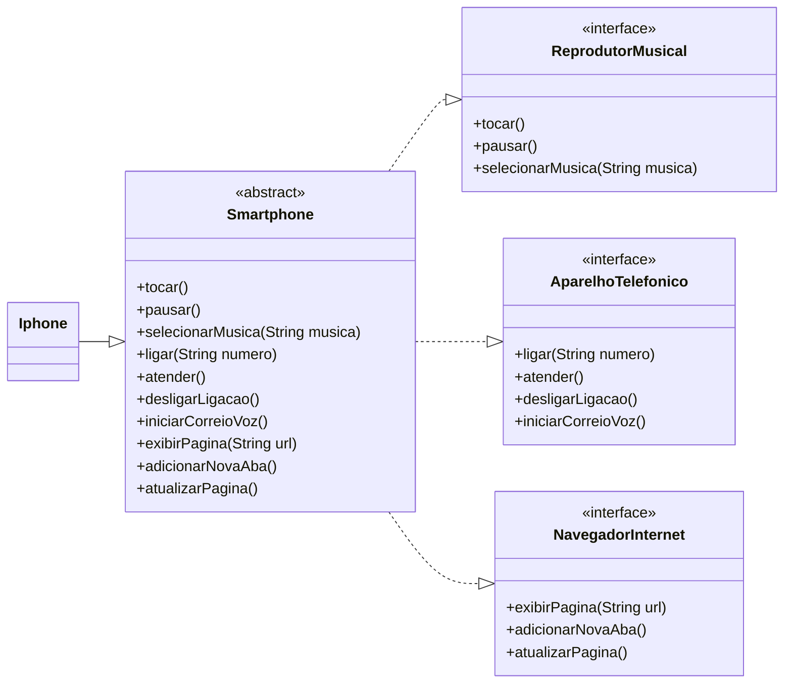

```mermaid
classDiagram
    direction LR
    class AparelhoTelefonico {
        <<interface>>
        +ligar(String numero)
        +atender()
        +desligarLigacao()
        +iniciarCorreioVoz()
    }

    class NavegadorInternet {
        <<interface>>
        +exibirPagina(String url)
        +adicionarNovaAba()
        +atualizarPagina()
    }

    class ReprodutorMusical {
        <<interface>>
        +tocar()
        +pausar()
        +selecionarMusica(String musica)
    }

    class Smartphone {
        <<abstract>>
        +tocar()
        +pausar()
        +selecionarMusica(String musica)
        +ligar(String numero)
        +atender()
        +desligarLigacao()
        +iniciarCorreioVoz()
        +exibirPagina(String url)
        +adicionarNovaAba()
        +atualizarPagina()
    }

    class Iphone {
    }

    Smartphone ..|> ReprodutorMusical
    Smartphone ..|> AparelhoTelefonico
    Smartphone ..|> NavegadorInternet
    Iphone --|> Smartphone
```